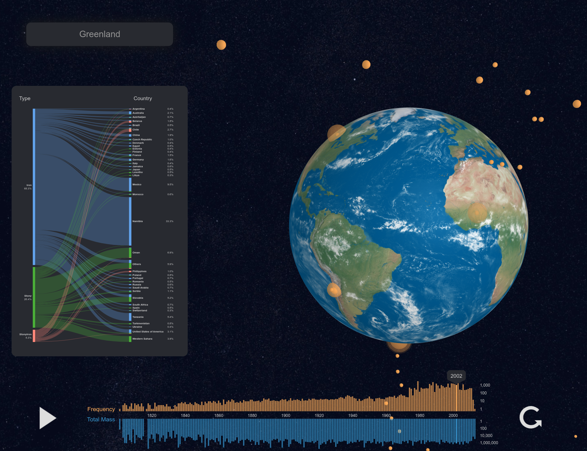

# GeoMeteorites

GeoMeteorites is an interactive visualization of the history of meteorites on Earth, using [D3](https://d3js.org/) and [Three.js](https://threejs.org/).
It was developed in 2018 as a group project for the [EPFL](https://www.epfl.ch/en/) Data Visualization course (COM-480).

<h1 align='center'><a href='https://raja-s.github.io/GeoMeteorites'>Try it out here!</a></h1>

A pre-recorded demo is also available [here](https://youtu.be/8MsuDOANd18).

## Data sources

The following sources were used for the data:

* The meteorites data (date, coordinates, composition) is from [this dataset](https://www.kaggle.com/datasets/nasa/meteorite-landings) collected by the Meteoritical Society and published by NASA
* The mapping from coordinates to country was performed using [OpenStreetMap](https://www.openstreetmap.org) data
* Information on notable meteoric events is taken from the [International Comet Quarterly](http://www.icq.eps.harvard.edu/meteorites.html)

## Report

For more information on the design and development phases, you can access our project report [here](https://raja-s.github.io/GeoMeteorites/com-480/report.pdf).
